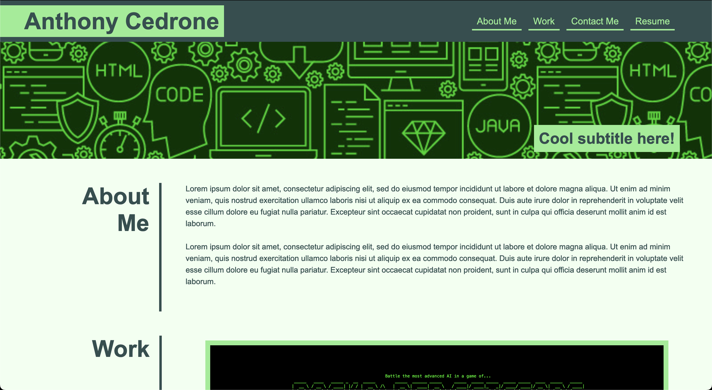

# Advanced CSS Portfolio

## Description

https://antced.github.io/advanced-css-portfolio/

CSS Portfolio made from scratch using some of the following features:

- Flexbox
- Background Images
- Media Queries
- Pseudo Classes

## Credits

Worked on as a project for UPENN's coding bootcamp under the instruction of Leif Hetland.

